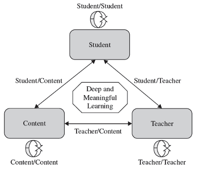
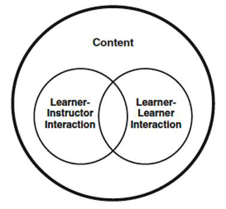
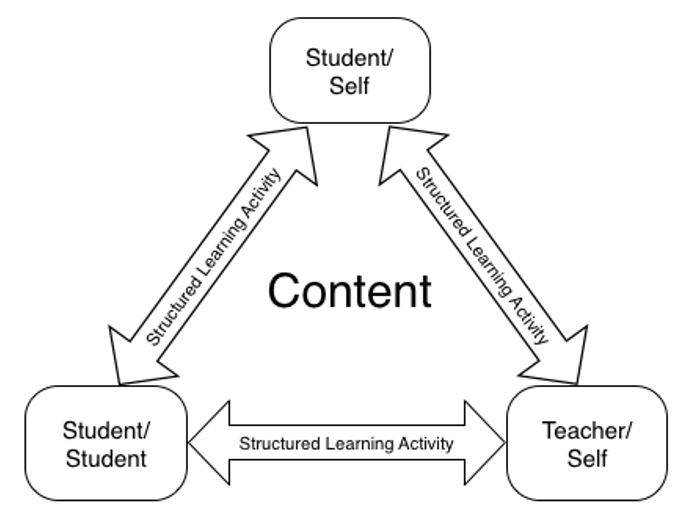

# Introduction 

Ask five different people what contributes to the success of graduate students in online higher education and you may well get five different and contradictory answers, and all five answers may be correct. Student success in online distance learning is critical to economic and social prosperity in our modern, knowledge based economy (Contact North, 2014).  With so much information available to modern citizens from sources that may or may not be reputable or authoritative, it is important that graduates of our colleges and universities have the desire and the skill to think critically about what they see, read, or hear (Arum & Roksa, 2011a).

But what is critical thinking? How do we know when critical thinking is happening? How can we ensure that students in online distance learning environments have the structure that they need to develop critical thinking skills? What can instructors and designers do to ensure that their students are not just memorizing information without understanding the deeper meanings and connections to other ideas and disciplines? How can student interactions be structured so that they promote deep approaches to learning and critical discourse? These questions provoked this exploratory mixed methods investigation to examine the study buddy activity, a cooperative learning strategy for increasing academic engagement by enhancing student-student interaction in online learning.

Two theoretical constructs that seem to provide a foundation to ground efforts to improve online learning are student engagement (Axelson & Flick, 2011; Carini, Kuh, & Klein, 2006) and academic rigour (Arum, Roksa, & Cho, 2011; Green, 2005; Lunney, Frederickson, Spark, & McDuffie, 2008). Student engagement is the degree to which students are involved and interested in their studies and feel connected to their institutions (Axelson & Flick, 2011). This construct has been studied extensively in the last decade, most notably through Kuh’s development of the National Survey of Student Engagement (NSSE, pronounced ‘Nessie’) (National Survey of Student Engagement, 2011). Another concept, academic rigour, refers to the degree to which higher education learning experiences promote skills in critical thinking, complex reasoning, and written communication (Arum & Roksa, 2011a).

Unfortunately, it seems that strategies used to increase student engagement may be at odds with strategies used to foster academic rigour. For example, Arum et al. (2011) argue that students who study alone seem to be better able to think critically and solve complex problems when compared to those who study in groups, perhaps an argument against collaborative learning. Conversely, Axelson and Flick (2011) point out that the NSSE is designed on the assumption that student participation in collaborative learning activities is an indicator of a quality learning environment. Despite this apparent contradiction, academic rigour is considered to be an important component of student engagement. Given the overlapping and sometimes counter-intuitive nature of the student success landscape with respect to student engagement and academic rigour, it is important for instructional designers, administrators, instructors, and students to seek clarity and understanding regarding what specific constructs and behaviours contribute positively to student learning in graduate-level online distance learning.

Arum, Roksa, and Velez (2008) began a longitudinal investigation in 2005 to directly measure individual students’ abilities to think critically, solve complex problems, and communicate in writing. Using the Collegiate Learning Assessment from the Council for Aid to Education (Council for Aid to Education, n.d.) Arum, Roksa, and Velez tested over 2300 incoming freshmen at 24 institutions in the fall of 2005, in the spring of 2007, and again in the spring of 2009 to determine how their skills in critical thinking, problem solving, and written communication had improved over the two-year intervals. These results were then cross-referenced with detailed student demographic data, transcripts, and supplementary surveys to give the researchers a detailed view of the factors that limited or promoted academic success in higher education.

Their findings were troubling. Reports from the study indicated that 45% of the students did not show any improvements in their ability to think critically, solve complex problems or communicate in writing over their first two years of postsecondary education and 36% showed no significant improvement over the full four years of their degree program (Arum et al., 2011). Furthermore, they found that academic success was positively related to academic rigour, but negatively related to social engagement. Increased involvement with social activities, such as studying with peers or involvement with fraternities, was found to be related to decreased performance on the Collegiate Learning Assessment over the four-year period.

However, contradictory findings have been reported in other research. Anderson (2003a, 2003b) concluded that interaction increases engagement and that the source of that interaction could be with faculty, other students, or content. In contrast to the general negative effect of social engagement noted by Arum et al. (2011), it may be argued that specific well-structured learning activities that encourage social engagement can be used to scaffold critical discourse and have a positive effect on learning. Moreover, cooperative learning strategies may be useful in promoting “learner agency” (Irvine, Code, & Richards, 2013, “Agency for Learning”), which is essentially the ability of learners to choose how they will meet their learning needs. Irvine et al. argue that learner agency has become a critical component of effective, modern learning environments.

One design that seems to hold particular promise in encouraging critical thinking is the use of study buddies in online distance learning courses. The study buddy activity that formed the basis of this investigation had not been systematically analyzed before it was implemented in a graduate-level course at a western Canadian distance university. The activity was intentionally designed and facilitated to encourage engagement with remote peers within an academically rigorous atmosphere. Based on cooperative learning theory (Johnson, Johnson, & Holubec, 1994; Johnson & Johnson, 2002), the study buddy strategy provides a series of structured activities that require students to work in pairs throughout a graduate-level online course (Richards, personal communication). Richards’ strategy was intended to reduce the isolation reported by many distance learners by encouraging students to engage in deeper levels of critical thinking and discourse by reviewing and critiquing each other’s coursework. It was expected that students who participated in the activity would be more academically and socially engaged in the course work than students who choose to work individually. Learner agency is promoted by the activity by providing options to students who may choose to work independently or with a partner: also by giving those who choose to work with a partner options with respect to how they will satisfy the requirements of the activity.

## Historical Context of the Study {-}

The traditional “face to face” (f2f), classroom-based model of higher education involves students traveling to a central campus in order to attend classes involving lectures, assigned readings, discussion groups, and/or laboratory experiences. Students often have the opportunity to interact with professors, fellow students, or teaching assistants (usually senior or graduate students) in f2f higher education.  Even so, this situation is changing. Many post-secondary instructions today offer some form of distance or blended courses. Garrison and Cleveland-Innes (2005) contend that this interaction with peers and mentors forms the core of the learning experience in modern higher education.

Distance learning courses and programs have historically been offered through printed materials sent by postal mail, through radio and television programming delivered over the air, or through a combination of both, often with pre-recorded audio and video sent through the mail (Rumble, 2001). These methods were considered to be poor approximations of a “real” higher education experience because the interaction between students and faculty (and even more so between students and their peers) was either so slow as to be virtually ineffective (students would have to wait for several days or weeks to get any feedback from their instructor), or it was non-existent. However, recent advances in the capabilities of modern personal computers as well as the Internet have created opportunities for distance students to reap similar benefits as those attending campus-based institutions with regard to interactions with peers and mentors. Online distance learning has prompted a renaissance of sorts for the field of online distance learning (Rumble, 2001).

In contrast with earlier distance learning models, students in online courses and programs today can interact with an extensive collection of media-rich learning materials; with a few mouse clicks, they can access thousands of scholarly journals in hundreds of databases; they can interact virtually face-to-face with their instructors in real time; they can collaborate on assignments and projects with distant peers, and they can do most of it at any time or place. Distance learners are most often separated geographically, and now, with modern information and communication technologies, they can also be separated across time zones.

However, despite the reported educational advantages to learners interacting across time and place, it is also true that the technology supporting the network can be misused. Too many well-intentioned educators use the Internet as a place to store static materials such as lecture notes or articles, which can turn a class website into a passive “page-turner” for a print-based course (Lee & Dashew, 2011; Pelz, 2010). Even those instructors who use the Internet to promote interaction with discussion forums may lack guidance and professional development on best practices for designing the discussions to maximize student interaction with the aim to promote critical thinking (Garrison & Cleveland-Innes, 2005).

In the same way that it would be inadequate to tell students in a face-to-face class to “Talk about the article,” and hope that they are fully engaged in the resultant activity, it is also inadequate to post some questions on a discussion board and expect that students’ posts will show evidence of critical thinking (Kanuka, 2005). If a learning activity is intended to promote learner agency and critical thinking skills in an online environment, the activity must be designed with those goals in mind and its structure and directions should guide the process to ensure that the learners are in fact thinking critically and that they have options with respect to how they will meet the objectives of the activity.

Considering that many faculty do not have sufficient training in instructional design or the facilitation of online learning experiences or even teaching in general, it is important to investigate ways in which critical thinking skills can be embedded into the design of online distance learning courses and to specify how instructors can best facilitate those learning experiences. By ensuring that students can engage in critical thinking and complex reasoning, and communicate in clear, written language, we can avoid creating graduates of our higher education system who cannot think or reason well.

Cooperative learning researchers (Johnson & Johnson, 1999b; Slavin, 1980) suggest that structuring learning activities to require cooperation and providing students with the appropriate cooperative and cognitive skills are essential prerequisites to realizing the goal of student-student interactions that generate and require critical thinking skills. Instructors cannot assume that simply allowing or requiring students to work in dyads or small groups will provide significant learning benefits.

## Interaction {-}

From the Socratic dialogue of the ancient Greeks to the academic debates characterizing the advent and modernization of universities, one of the defining features of quality educational experiences has been interaction. Interaction is so central to the learning process that it is difficult to imagine an educational experience that does not involve some sort of interaction. Even isolated individuals must interact with their environment in some way that initiates the process of cognitive restructuring or learning. Furthermore, the very process of cognitive restructuring implies that there is an interaction between new ideas and old to create an updated mental model (Dewey, 1916).

Anderson (2003b) highlights various different ways to understand the notion of interaction and settles on Wagner’s (1994) definition of interaction: “reciprocal events that require at least two objects and two actions. Interactions occur when these objects and events mutually influence one another” (p. 8). In the case of the study buddy activity, it is the idea of mutual influence, especially positive influence between students and their partners, which is the desired outcome of the activity.

Several theorists have identified different modes of interaction in educational contexts such as that between and among students, teachers, and the content that is to be learned (Anderson, 2003a, 2003b; Bernard et al., 2009; Kanuka, 2011; Moore, 1989). The three principal modes of interaction in education are student-student, student-teacher, and student-content. Anderson and Garrison (1998) introduced a model that includes the three primary forms of interaction and also expands to include other forms, such as teacher-content interaction, which are important, but beyond the scope of this thesis (Figure 1). The two diagonal arrows between their respective objects indicate student-teacher interactions and student-content interactions, and the recursive arrow at the top of the diagram indicates student-student interaction. These three primary forms of student interactions are described in the following sections.

### Student-teacher interaction. {-}

Systems dedicated to formal education have typically emphasized student-teacher interaction as being of critical importance (Anderson, 2003a; Moore & Kearsley, 2005).  Moore and Kearsley note that teachers often interact with students in order to stimulate interest and motivation to learn as well as help students apply their learning. Ally (2008) notes that while online distance learning is always mediated by some sort of technology, digital or otherwise, the learning that happens cannot be attributed to the technology itself, but rather to the activities and strategies designed into the learning materials as well as the instructor’s guidance and direction of the learning activities.

Examples of student-teacher interactions include, but are not limited to, the following:

- lectures or tutorials (provided students can ask questions and offer comments);
-  question-and-answer sessions about content, class procedures, difficult topics, personal issues, and so on;
- feedback on assignments;
- postings and responses in discussion forums;
- e-mail or instant messages;
- one-to-one conversations via telephone or Skype;
- synchronous web conferences.

Anderson (2003a) points out that student-teacher interaction is generally very expensive and the cost increases with increasing numbers of students, making it generally the least scalable mode of interaction.
Student-content interaction.

If student-teacher interaction is important, then it would seem also that student-content interaction is a primary reason why formal educational systems exist. Content in reference to learning environments is simply the subject matter that is to be learned (Moore & Kearsley, 2005). As such, content can be seen as being either external to the learner, in the case of a learner studying the process of plate tectonics; or it can be internal to the learner, in the case of a learner examining his or her own assumptions about a topic.

If there is no content to be learned, then it seems that learning cannot take place at all. Whether the learner is a kindergartener learning the alphabet or a doctoral student learning a new statistical analysis technique, every student in a formal educational environment has something to learn. Student-content interaction is the primary mode of interaction in historical text-based learning environments delivered as printed materials.

Examples of student-content interaction include:

- students listening to a lecture (live or recorded),
- reading topical commentary in a learning management system or in printed materials,
- taking notes,
- performing research,
- memorizing facts,
- metacognitive strategies such as journaling,
- solving problems,
- resolving apparent contradictions,
- examining foundational assumptions.

In higher education, student-content interaction can be scaled up quite dramatically, as evidenced by the large enrolments in some required undergraduate, lecture-based courses at large universities. When hundreds of students are enrolled in a course, student-teacher interaction is difficult, if not impossible, so the emphasis must shift to student-content interaction in the form of lectures and assigned readings.
Student-student interaction.

Early distance education was impoverished with respect to student-student interaction. When content was delivered via mail or through slow one-way communications, there was often no possibility that students would even know about, much less interact with, each other (Anderson, 2003b; Moore & Kearsley, 2005). Fortunately, advances in communication technologies have opened up significant opportunities for students to interact with each other synchronously through web-conferencing or text chat, and asynchronously through discussion forums, email, and text messages on mobile devices, as well as through social networking software such as Facebook™ or The Landing, a semi-private social networking site hosted by Athabasca University for their students, staff, and faculty. Like student-content interaction, student-student interaction is extremely scalable, and should be encouraged provided the activities have educative value and are not simply social in nature.

The student-student mode of interactions in online distance learning is the focus of this thesis research, particularly the nature of student-student interactions in the study buddy activity and how the activity should be structured to support and facilitate critical thinking and discourse and meaningful engagement.

Examples of activities that promote student-student interaction include the following:

- cooperative learning activities,
- collaborative research and design;
- problem- or project-based learning,
- debates,
- discussion forums,
- social media, such as blogs or wikis,
- study groups,
- virtual communities.

## Interaction Equivalency Theorem {-}

In 2003, Terry Anderson proposed what he called the Interaction Equivalency Theorem, in which he states:

> Deep and meaningful formal learning is supported as long as one of the three forms of interaction (student–teacher; student-student; student-content) is at a high level. The other two may be offered at minimal levels, or even eliminated, without degrading the educational experience.

> High levels of more than one of these three modes will likely provide a more satisfying educational experience, though these experiences may not be as cost or time effective as less interactive learning sequences. (Anderson, 2003a, p. 4)

A possible interpretation of the theorem is the idea that students can learn equally well regardless of whether they were interacting with a teacher, with other students, or only with the content, provided the interaction is of sufficient quality and quantity. Imagine that student A learns about Newtonian mechanics by asking questions of his or her instructor (student-teacher interaction), student B learns about Newtonian mechanics by joining a study group of fellow students (student-student interaction), and student C learns about Newtonian mechanics by reading about it in a book (student-content interaction). If, following their different learning activities, the students perform equally well on an assessment of their knowledge of Newtonian mechanics, we would be justified in stating that there is no significant difference between the three modes of interaction with respect to fostering learning.

Bernard et al. (2009) found empirical support for Anderson’s theorem in a meta-analysis of research articles related to different modes of interaction in distance education.  Bernard and his colleagues conducted a meta-analysis of research comparing different interaction treatments in online distance learning. They examined a total of 74 reports that fit their criteria and categorized them according to student-student, student-teacher, or student-content interaction treatments.

Bernard et al. (2009) found that there was an average effect size of +0.38, indicating that the interaction treatments had a moderate, positive effect on achievement and that the greatest effects were found to be associated with student-student (+0.49) and student-content (+0.46) interactions, which were considered to be not significantly different from each other. The smallest effect size was for student-teacher (+0.32) interactions. They also found that when the strength of a particular interaction treatment increased, the average effect size also increased, suggesting that higher quality interactions generally lead to better achievement, a finding that supports Anderson’s equivalency theorem.
Among the recommendations put forth by Bernard et al. (2009) was the suggestion that the use of cooperative learning techniques to promote positive interdependence and personal accountability in structured learning activities was one way for designers to ensure high-quality interactions and that there should be a strong emphasis on deep interaction with content to ensure that integrative learning is supported. While Bernard et al. found support for the inclusion of student-student and student-content interaction in particular, they could only speculate as to the underlying causes of increased learning in learning environments with higher quality interactions.
Refining Anderson’s model of interaction.

Following Anderson (2003a), Kanuka, (2011) points out that many distance educators tend to view the different modes of interaction as being independent of each other, when in reality, they are all very interconnected. She maintains that both student-teacher and student-student interactions, at least those that are of educational value, occur within the context of the content to be learned, and suggests that Anderson’s interaction model could be modified as depicted in Figure 2.

While Kanuka’s model may provide clarity on the role of content in educative interactions, it seems to present fewer options for students and their interactions. In Kanuka’s model, students interact with either other students or with their teacher.

What neither of these models seems to capture, however, is that there could be two different types of student-student interactions. On one hand, student-student interaction could refer to the structured peer interactions that are designed to encourage critical discourse around the content, but on the other hand, it could also refer to the inner, reflective transformations of ideas as an individual student reorganizes his or her cognitive models. A synthesis of these two models, which incorporates both types of student-student interaction, might be depicted in the Structured Student Interactions model as shown in Figure 3.
Structured Student Interactions model.

The Structured Student Interactions model shows the three objects that may interact with each other as the student (top), other students (left), and teachers (right). The structure of each of the three objects in the model indicates that reflective interaction, or metacognition, is an important component of learning and may happen within the student, within other students, and within the teacher. The three arrows between the objects indicate that the interactions between the objects happen through structured learning activities such as the study buddy activity or a debate. At the top of the model is the student who is engaged in learning. The model shows that the student may interact with themselves, with other students, or with their teacher about the content to be learned and through structured learning activities.

In addition, the Structured Student Interactions model incorporates the idea that students can learn by observing the interactions between and among their peers and the teacher, a process known colloquially as lurking in online forums, and more officially as “vicarious” interaction (Sutton, 2001). While Anderson (2003b) specifically sets vicarious interaction aside as a byproduct of the other forms of interaction and as being dependent upon agents external to the student, the author’s personal experience has been that vicarious interaction can be a valuable educational experience, especially in an online course where those interactions happen in a discussion forum and are observable by other course participants. Furthermore, although they were not specifically measuring learning, Moisey, Neu, and Cleveland-Innes (2008) found that the number of forum postings that students read per week (lurking behaviour) was significantly correlated to students feeling connected to the classroom community, while posting and replying to messages was not. While feeling connected to a community does not guarantee that a student is meeting learning objectives, it is a construct valued by those who want to increase student engagement.

## Context of the Study {-}

The study buddy activity was a voluntary learning activity in a graduate-level, asynchronous, online distance learning course in instructional design (MDDE 604) offered by Athabasca University. MDDE 604 is a required course for the Master of Education (Distance Education) as well as the Post-Baccalaureate Certificate and Diploma in Instructional Design programs offered through the Centre for Distance Education (CDE) at Athabasca University (AU). It is an elective for two other post-baccalaureate programs in the CDE as well as other faculties at AU.
Course description.

MDDE 604, Instructional Design in Distance Education, is the second of two required courses in instructional design for students working to earn one of the credentials outlined above. It is a project-based course that requires students to, over the course of four assignments, propose, design, and create a unit of instruction utilizing the theoretical foundations learned in the prerequisite, MDDE 603, Foundations of Instructional Design: Systems Analysis and Learning Theory. MDDE 604 is delivered as an online asynchronous course over 13 weeks through the learning management system, Moodle™. Assessment is based on completion of four mandatory and sequential assignments, three small group conferences, and the optional study buddy activity.

- Assignment One (20%): complete a needs analysis and proposal for the instructional unit.
- Assignment Two (10%): create the design specifications for the instructional unit.
- Assignment Three (10%): review a peer’s unit from a learner’s perspective and provide constructive feedback.
- Assignment Four (40%): complete the instructional unit including discussions of the design of the unit, plans for revising and updating the content, student assessment, and the logistics of delivery.
- There are three conferences (two asynchronous and one synchronous) that together comprise the remaining 15% of the final grade.
- Students who complete the requirements of the optional study buddy activity can earn up to 5% extra to be added to their final grade.

### Rationale for and structure of the activity. {-}

A significant component of the context of the activity is the instructor’s rationale for including the activity in the course. His rationale is summarized below.

Students in MDDE 604 are most often mid-career professionals with very busy lives outside of their studies including full-time employment, families, and various community responsibilities. They are often returning to school after working for a number of years and may not be entirely comfortable writing at a graduate level, although this course can only be taken if the student has previously passed at least one other graduate-level course. The nature of online distance learning is such that it can often be a lonely and isolating experience.

The initial impetus for the activity was to provide a way for students to have their work previewed prior to submission to the instructor who found that he was spending too much time grading papers which were below acceptable academic standards for a graduate-level course. The instructor found that there were too many careless errors such as spelling mistakes and poor grammar as well as evidence that the assignments were rushed and not carefully considered prior to submission. The instructor thought that the students were somewhat unaware that they were more capable writers than was evidenced in their assignments and that they just needed a little proofreading and feedback to help them achieve greater success in their writing. The instructor’s previous research into cooperative learning strategies led him to consider the study buddy activity as a way to address these issues and incorporate a small-scale peer review process into the course while maintaining individual accountability. The voluntary nature of the activity and the extra credit for completion were due to the fact that the activity requires extra work for already busy students.

While there is little prescribed structure for the activity, the structure that is there is designed to increase the chances of success for study buddy partnerships. For example, those who consider themselves “bunnies”, who like to complete their work well ahead of schedule, and those who consider themselves “bears”, who typically work closer to assignment deadlines, are encouraged to find partners who are similar to themselves to avoid conflict related to the timing of the peer review process. Furthermore, the structure is intended to help those who might otherwise be unwilling or reluctant to reach out to others in the course.

The study buddy activity requires students to find a partner in the class with whom they will exchange assignments a few days prior to the assignment deadline for the purposes of providing constructive feedback. Students who complete all the requirements of the activity can earn up to an additional 5% towards their final grade. The activity is introduced to students in the course with the following description (Richards, personal communication, January 3, 2013):

> Up to five additional points can be earned by pairing up with a classmate and reviewing each assignment before it is submitted to the instructor.

> A short (1-2 page) reflection on the activity is due at the end of the course. You will be “audited” and asked to submit your review work in order to get the bonus marks (nothing for free these days). The reflection should answer questions like: How did you choose your Buddy? How did you organize your work? What were the positives and negatives you experienced? In what ways did it improve your learning? Would you recommend it for the next course? Please add any suggestions for improving this activity.

The instructor leaves it up to the students to organize themselves into pairs and after the first week of the course, posts the following announcement or one similar:

**Week 1 Instructor Announcement – hints for success in the course:**

Find a good Study Buddy and work together to improve each other’s work. While the buddies’ commitment is to exchange & proofread assignments 3 days before the due dates (to have time to make fixes) most buddies end up discussing assignments at the beginning, middle and end. (I’ll send more info on the study buddy bonus later).

After the third week, the instructor posts another announcement:

**Study Buddy Reminder**

Just a reminder that Wednesday is your last day to find a Study Buddy partner (because Assignment 1 has curmudgeons, to be exchanged 3 days prior the due date). Study Buddy is not for everyone, procrastinators and short cutters tend not to fare well. But when sincere bears match with bears and bunnies with bunnies it tends to out a whole new spin on learning at a distance.

Occasionally, a study buddy partnership does not work out so the instructor allows participants who might unwittingly find themselves without a functioning partnership to back out and find a new partner. There was one case in this investigation where the instructor needed to help a stranded partner find a new partner.

An advantage of an activity like the study buddy activity is that it is a structural element of a learning task and can be employed in a wide variety of disciplinary contexts and learning tasks. Showing empirically the study buddy activity to be a structure that tends to promote deep approaches to learning as well as social engagement would be of significant benefit to instructional designers, teachers and administrators and perhaps the apparent contradiction between the work of Arum et al. (2011) and Kuh (2001) could be resolved.

## Significance of the Study {-}

This study will potentially benefit a number of different but overlapping communities. For example, instructional designers will more clearly understand the rationale and benefits of incorporating cooperative learning activities and study buddy experiences into their courses, faculty developers will be able to assist faculty who are transitioning to a blended or online model with recommendations for activities that can be implemented in a diverse set of circumstances, and students will be encouraged that the work of engaging with a peer will be beneficial in their studies and careers. Furthermore, the study may provide a foundation for those who wish to promote engagement and critical thinking in massive open online courses (MOOCs) as well as for universities considering the use of social networking software.

## Purpose of the Study {-}

The purpose of this study was to explore the study buddy strategy as one that uses well-structured student-student interaction as shown in the Structured Student Interactions model to promote deeper approaches to learning and, by extension, the ability to think critically, a key indicator of success in post-secondary studies. Additionally, following Slavin’s (2011) integrated model of cooperative learning, the study explored various ways in which the study buddy activity might affect student approaches to learning, including encouraging social cohesion and motivation, providing developmentally appropriate learning, and promoting cognitive restructuring. Finally, the study explored participants’ perceptions related to the logistics and structure of the study buddy activity.

The thesis investigation explored the following questions related to the study buddy activity:

- Do online graduate students who participate in a structured study buddy activity tend to use deep approaches in their learning?
- As a cooperative learning activity, does the study buddy activity provide sufficient scaffolding to promote deep approaches to learning?
- In what ways do students find value in the study buddy activity?

## Limitations and Definitions {-}

Limitations of the study (i.e., those factors that constrained the study and were beyond the control of the researcher) included the fact that the participants were graduate students and therefore may have been more inclined to take a deep approach to learning and more able to think critically than undergraduate students. Also, as the study buddy activity was voluntary, participants might have been more motivated to take deeper approaches to learning than non-volunteers. Finally, as the quantitative part of the study was a quasi-experimental design with a non-random sample of participants and no control group, the results are not generalizable to other contexts.

Delimitations of the study (i.e., those factors that restricted the study and were under the control of the researcher) included the fact that the study buddy activity in one course offered by one faculty member was examined.  Also, because the study utilized an instrument designed to measure student approaches to learning within a particular personal and teaching context (the study buddy activity in MDDE 604), the findings cannot be extended to other learning activities or contexts. Finally, the study only explored one possible cooperative learning structure out of many that could have been explored.
Definition of Terms

**Academic rigour:** the degree to which programs and courses are cognitively challenging as measured by the amount of reading and writing students are required to do, how much students study alone, and how many students report that their instructors have high expectations. Measurable outcomes of academically rigourous learning experiences include critical thinking, complex reasoning and written communication skills (Arum & Roksa, 2011b).

*8Cooperative learning:** instructional methods that involve organizing students into dyads or small groups which must then rely on each other to learn the prescribed material (Slavin, 2011). Cooperative learning activities are structured so that the success of each student is dependent upon and promotes the success of the other students (Slavin, 1980).

**Critical thinking:** the ultimate goal of higher education, which is characterized by students’ ability and willingness to reason well, solve complex problems, draw inferences from evidence, and question tacit assumptions. Critical thinking has been called “cautious intelligence” and “reflective skepticism” (Brookfield, 1987, p. 21).

**Deep learning approach:** an approach to learning where the student uses appropriate and meaningful cognitive strategies to understand, extend, and apply their knowledge (Biggs, Kember, & Leung, 2001, p. 21).

**Interaction:** one of the defining traits of educational contexts. Described as “reciprocal events that require at least two objects and two actions. Interactions occur when these objects and events mutually influence one another” (Wagner, 1994, p. 8).

**Online distance learning:** subset of distance learning where instructors and learners are separated geographically, and sometimes temporally, and significant learning outcomes are met primarily using asynchronous, Internet-based tools. Online distance learning can include blended learning environments where significant learning outcomes are also met in a face-to-face environment.

**Surface learning approach:** an approach to learning where the student is mostly concerned with doing as little work as possible to complete the requirements of the task. This approach is characterized by the use of low-level cognitive strategies such as rote memorization of facts, when higher level strategies such as synthesis of disparate ideas are required for the task (Biggs & Tang, 2007).

## Chapter Summary {-}

This chapter introduced the study buddy activity as the object of this thesis investigation and outlined the historical and present contexts of the activity.  The chapter introduced two models of interaction that have previously been described in the literature and proposed a third model that could represent a synthesis of the previous models. Chapter I introduced the research questions and outlined the limitations and delimitations of the study. The chapter concluded with a discussion of several key terms related to the study.

**Organization of the Thesis**

This thesis consists of seven chapters beginning with the introduction to the context of the study and the research questions in Chapter I. Chapter II presents a review and discussion of the scholarly literature related to the theoretical foundation of the study. Important topics in the review of the literature are the nature of social constructivism as a learning theory; cooperative learning; a discussion of critical thinking, what it is, and how it can be fostered in higher education; and the idea of students’ approach to learning. Chapter III describes the method used to conduct the research, including a description of the characteristics of mixed methods research and a visual diagram of the structure of this investigation. The chapter concludes with a brief discussion of how the quantitative and qualitative data were analyzed and merged into a unified conclusion. Chapter IV describes the analysis of the quantitative data with respect to the research questions. Chapter V is a description of the qualitative data analysis following phenomenological procedures. Chapter VI discusses how the quantitative and qualitative phases of the research were merged into a unified statement of the results. Chapter VII presents the conclusions of the research, recommendations for the implementation of the study buddy activity, and questions for further study.
