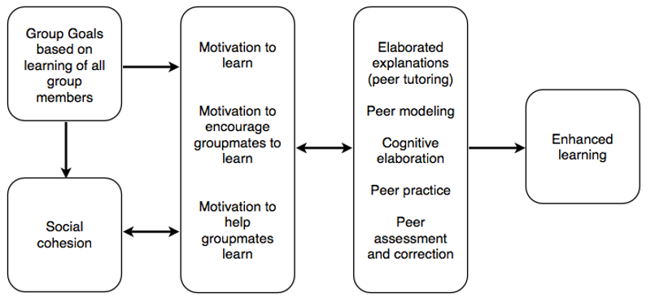

# Merged Analysis and Results

## Merging the Quantitative and Qualitative Analyses {-}

Creswell’s (2009) final step in conducting mixed methods research is to merge the quantitative and qualitative analyses together into a unified whole. The following chapter outlines how the two analyses compare to each other and how the merged analysis might be stronger than either one individually. Additionally, findings from this study are related back to the theoretical models of interaction (Anderson, 2003a; Kanuka, 2011), cooperative learning (Slavin, 2011) and the 3P model of teaching and learning (Biggs et al., 2001).

As presented in Chapter I, the study examined three research questions related to the study buddy activity in an asynchronous online distance learning environment.

- Do online graduate students who participate in a structured study buddy activity tend to use deep approaches to their learning?
- As a cooperative learning activity, does the study buddy activity provide sufficient scaffolding to promote deep approaches to learning?
- In what ways do students find value in the study buddy activity?

The following sections summarize the quantitative and qualitative findings with respect to each of the research questions.

## Research Question One {-}

**Do Online Graduate Students Who Participate in a Structured Study Buddy Activity Tend to Use Deep Approaches in Their Learning?**

The quantitative analysis found no significant difference between the approaches taken by participants and non-participants in the study buddy activity. This finding may have resulted from the survey instrument not being sensitive enough to detect differences in such small samples of participants (n=25) and non-participants (n=6). It is also likely that there really was no difference in the learning approaches of the participants and non-participants; it may be that graduate students in general, because they are typically more mature and capable than undergraduates, are simply more likely to take a deeper approach (Cleveland-Innes & Emes, 2005).

The qualitative analysis supported the idea that students in MDDE 604 are willing and able to engage in at least some deep strategies such as seeking alternative opinions in the literature and applying their learning to their work outside of the course. Further analysis of the qualitative data in relation to the third research question showed that there may have been a difference not detected in the quantitative data, that being that participants in the study buddy activity reported that the deep strategies that they used went beyond searching the relevant literature. Built into the study buddy activity was the need for participants to submit their work to an actual person, a peer who has committed to helping their partner improve their work.

Although it was only implemented on a small scale, the peer review activities associated with the study buddy activity such as providing critical feedback and offering suggestions for improvement appear to encourage those who already take deep approaches to extend the depth of their interactions with the course content and with their peers.

## Research Question Two {-}

**As a Cooperative Learning Activity, Does the Study Buddy Activity Provide Sufficient Scaffolding to Promote Deep Approaches to Learning?**

A key recommendation of this study is that learning activities must be well structured in order for students to benefit fully. The quantitative analysis suggested that the structure, specifically the “bunny” and “bear” characterizations currently in place for the study buddy activity, is unnecessary as only 12% of participants reported that the characterization was helpful and 60% were ambivalent. Furthermore, the three participants who reported having a bad experience in the activity all had a partner with a different profile; however, another four participants had a good experience with a partner with a different profile. It would appear that any significant conclusions based on the quantitative findings alone would be tenuous at best. However, when considered along with the qualitative findings, stronger inferences may be drawn.

Those who chose to not participate in the study buddy activity did so primarily for three reasons, they did not want to end up with an incompatible or lazy partner, they preferred to work alone, or they didn’t feel that they had enough time to invest in the activity. Those who did participate but had a negative experience reported the same concerns, i.e., their partner’s motivations or input were incongruent with their own. It is interesting that they did not frame their concerns or negative experiences in terms of bunnies or bears, simply that their partnership was, or might have been, inequitable. It is possible that graduate students know intuitively and from experience in previous ill-structured group work that the consequences of having an incompatible partner are significant and obvious. As such, the descriptions of bunnies and bears may be just extraneous information that is already understood.

## Research Question Three {-}

**In What Ways do Students Find Value in the Study Buddy Activity?**

It seems unlikely that students will engage in learning activities for which the rationale is either unclear or not articulated at all. If students do not see any value in an activity, especially a voluntary activity, then they are less likely to participate. Students in this investigation were surveyed for their views on how the study buddy activity benefitted their learning in MDDE 604. Questions were intended to align with Slavin’s (2011) integrated model of cooperative learning.

Quantitative analysis showed that students valued the social cohesion effects of the study buddy activity most highly (M=4.12), followed by the idea that the activity provided developmentally appropriate challenges (M=3.70), motivation (M=3.62), and cognitive restructuring (M=2.92). In the same way that the quantitative and qualitative analyses produced slightly different findings with respect to the first research question, it seems that the qualitative analysis showed more evidence of cognitive restructuring than did the quantitative analysis.

In their qualitative responses, participants reported that through the process of interacting with their partner during the activity, they were confronted with alternate viewpoints that they had not previously considered. These alternate viewpoints, coming from a trusted and respected peer, prompted participants to consider their own views more deeply.

Aside from the different findings on the question of cognitive restructuring, both the quantitative and qualitative analyses strongly showed that the social aspect of the study buddy activity was very important to participants.
Negative Experiences and the Views of Non-Participants

The number of non-participants (n=6) was too small to draw any conclusions with any degree of confidence. Fortunately, the one area in which all six respondents agreed was that the time involved in participating in the study buddy activity seemed to be too great to justify the effort, a finding that was also supported in the qualitative analysis.

It is very interesting to note that, while the non-participants were most concerned about the time required for the activity, those who participated but reported a negative experience did not cite the amount of time the activity required as the primary cause of their negative report. Rather, they were most disappointed by the lack of reciprocal effort from their partner in providing too little or low quality feedback.

## Models of Interaction {-}

A foundational idea in the online distance learning literature is Anderson’s (2003b) model that describes the modes of interaction. More recently, Kanuka (2011) presented a variation on Anderson’s model, which inspired a further revision and integration of Anderson’s and Kanuka’s models, the Structured Student Interactions model. It was proposed that educative interactions (i.e., structured learning activities) occur within the context of the course content. The interactions can take the form of student-self (through reflection), student-student, and student-instructor (Figure 7).

A further, related idea is Anderson’s (2003a) Interaction Equivalency Theorem, which postulates that any of the modes of interaction may be reduced or eliminated, without degrading the learning experience, as long as one mode remains at a high level. This investigation has shown that high quality, content-focused student-student interactions can be successfully promoted by including a structured study buddy activity as an option in a course. Participants in the study buddy activity reported high levels of social interaction and cognitive engagement, both of which align with Anderson’s model and theorem, as well as the Structured Student Interactions model. Furthermore, Bernard et al. (2009), in their meta-analysis of interaction in distance education, found that the strongest learning effects were gained when student-student and student-content interactions were emphasized, a finding that seems to be supported by the high levels of social and potential for cognitive engagement in the study buddy activity.

## Integrated Model of Cooperative Learning {-}

Slavin’s (2011) integrated model of cooperative learning (Figure 8) is also foundational to understanding the study buddy activity and how it promotes social interaction and learning.

Based on student reports as well as knowledge of the structure of the study buddy activity, it appears that this activity aligns with Slavin’s model. From the outset, the activity featured group goals based on the learning of all members. In order for the activity to be successful, both partners had to be trustworthy to complete their work in submitting their assignments and feedback to their partner in a timely fashion. Social cohesion seemed to be the component of Slavin’s model with the most significant effect on the student experience, a finding supported by both the quantitative and qualitative analyses.

Slavin proposes three different motivational factors at work in cooperative learning environments: motivation to learn, motivation to encourage groupmates to learn, and motivation to help groupmates to learn. Of these three factors, the study buddy activity appeared to provide participants with motivation to learn as well as motivation to help groupmates to learn. Absent from these findings, at least explicitly, was the idea that the activity provided motivation for participants to encourage groupmates to learn (although this factor might be inferred from one participant’s report that his partner played a role in his decision not to drop the course.)

Slavin’s final group of factors relate to the cognitive restructuring effects of cooperative learning activities. As previously discussed, these effects seemed to be largely absent in this study. Slavin (2011) proposes that cognitive effects come about via elaborated explanations in peer tutoring situations, peer modeling, cognitive elaboration, peer practice, and peer assessment and correction. The study buddy activity works primarily through providing opportunity for participants to engage by assessing their partner’s work and providing corrective feedback which leads to the process of cognitive elaboration where the peer reviewer’s ideas are incorporated into the participant’s own mental models. Peer modeling may be happening in the background of the activity as good (or poor) study habits are demonstrated and passed along. The activity also serves as a kind of practice for the actual submission of the assignment to the instructor.

Given this close alignment with Slavin’s model, the study buddy should be considered a well-formed cooperative learning activity that promotes the acquisition of the intended learning outcomes.

## 3P Model of Teaching and Learning {-}

The final model that served as a basis for this investigation was the 3P (Presage, Process and Product) model of teaching and learning proposed by Biggs et al. (2001) (Figure 9)

 

In discussing the idea of a student’s approach to learning, Biggs et al. use the 3P model to describe the factors which influence whether a student will take a deep or a surface approach to learning. The model shows how student factors interact with the teaching context during the learning activities and lead to the attainment, or non-attainment, of the learning outcomes. They argue that the instructor is responsible for the design and structure of the learning environment and that the student is responsible for engaging appropriately with the activities.

In the context of the study buddy activity, the structure provided for students appeared to encourage the kind of cognitive skills required for critical thinking. Biggs et al. call this correspondence “constructive alignment” and contend that if students are consistently expected to take a deep approach to their learning and exhibit evidence of critical thinking, then the assessments in the course should be structured to align with that stated goal.

## Chapter Summary {-}

Chapter VI provided a description of how the quantitative and qualitative data analyses compared to each other and how the two phases of analysis could be merged into a stronger whole compared to either phase taken individually. The two phases were described according to each of the three research questions with points of convergence and divergence noted. Following that, each of the three models (interaction, cooperative learning, and the 3P model of teaching and learning) were discussed in light of the merged analyses.

